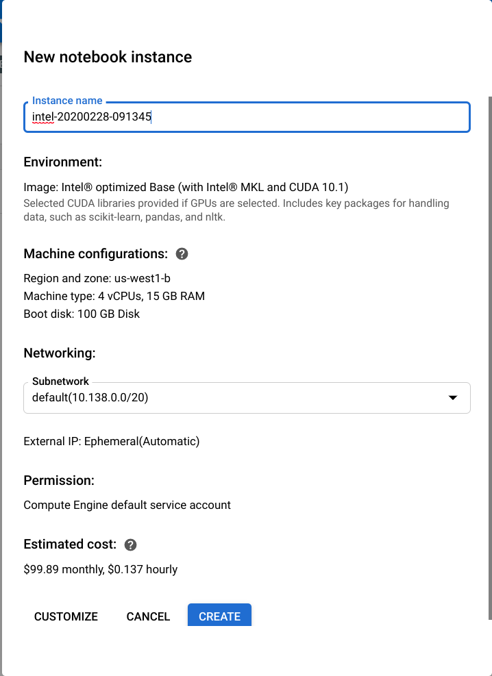
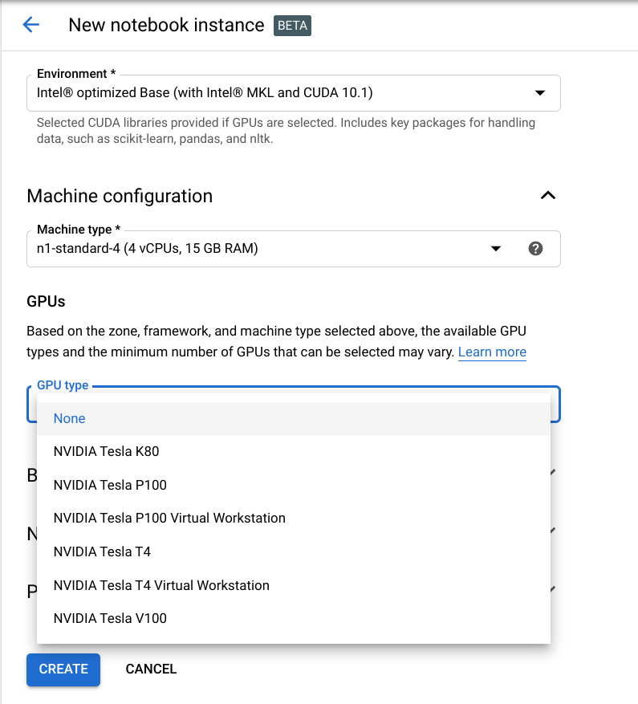
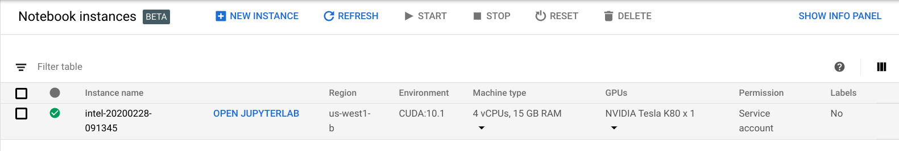
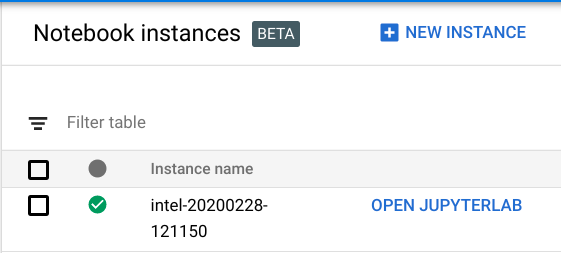
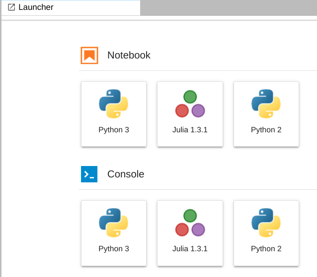

In this tutorial, you add a [Julia Programming Language](https://julialang.org/) kernel to the [JupyterLab](https://jupyter.org/) server hosted by an
instance of [Google AI Platform](https://cloud.google.com/ai-platform). Julia is a relatively new language that has emerged from MIT to address the
["two-language problem"](https://www.quora.com/What-is-the-2-language-problem-in-data-science)
in HPC, data science, ML and other compute intensive fields. The tagline "looks
like Python, feels like Lisp, runs like C" sums up Julia's goals of
simultaneously addressing *productivity*, *generality*, and *performance*
concerns in compute intensive problem domains.

## Objectives

- Enable AI Platform users to select a Julia kernel for their notebooks

## Before you begin

1.  [Create a new Google Cloud Platform (GCP) project](https://console.cloud.google.com/project), or use an existing one.
2.  [Enable billing for your project](https://support.google.com/cloud/answer/6293499#enable-billing).

## Costs

Check the [AI Platform pricing page](https://cloud.google.com/ai-platform#pricing) for details.

## Create an AI Platform Notebook

In the section, you create an AI Platform Notebook instance. An AI Platform Notebook instance is just
a Compute Engine VM that is running JupyterLab.

1. Go to the [**AI Platform Notebooks** page](https://console.cloud.google.com/ai-platform/notebooks)
   
2. Click **NEW INSTANCE**
   
3. Click **CUDA 10.1** > **Without GPUs**
4. (Optional) Change the generated **Instance name** to something more memorable
5. Click **CUSTOMIZE**
7. (Optional) Choose a different **Region** and/or **Zone**
8. (Optional) Choose a different **Machine type**
9. Choose a **GPU type** (*Note: don't choose a Virtual Workstation GPU type*)
   
10. Check the **Install NVIDIA GPU driver automatically for me** box
   
11. Click CREATE

It will take a few minutes to create the Compute Engine instance that hosts your notebook and configure
it with JupyterLab and the NVIDIA CUDA runtime and drivers. Once your notebook is ready you should see

## Install Julia

In this section you open your AI Platform Notebook and use the Terminal to install Julia.

1. Click **OPEN JUPYTERLAB**
   
2. Click **Other** > **Terminal**
   

In the terminal enter

    wget https://julialang-s3.julialang.org/bin/linux/x64/1.3/julia-1.3.1-linux-x86_64.tar.gz

When the download completes enter

    tar zxf julia-1.3.1-linux-x86_64.tar.gz
    rm julia-1.3.1-linux-x86_64.tar.gz
    sudo ln -s ~/julia-1.3.1/bin/julia /usr/local/bin/julia

Verify that Julia is in your path

    which julia

You should get the response

    /usr/local/bin/julia

## Add a Juila kernel

To make Julia available in your notebooks you need to add the Julia kernel to JupyterLab on your
AI Platform Notebook instances. Start the Julia REPL by entering

    julia

At the "julia> " prompt enter

    ]add IJulia CuArrays CUDAnative CUDAdrv

When the package installation is complete press Backspace to exit the package manager. 

Finally, install the Julia kernel by entering

    using IJulia

Exit Julia by pressing Ctrl+D

## Using the Julia kernel

In this section, you verify your Julia kernel installation with a simple Jupyter notebook.

Open a new Launcher tab by pressing Ctrl+Shift+L. You should see a card for Julia 1.3.1. (*Note:
it may take up to five minutes for the card to appear in the Launcher tab*)

## Cleaning up

To prevent unnecessary charges, clean up the resources created for this tutorial.

1.  Delete the project used (if you created a new project).
2.  Delete the Cloud Build trigger and Cloud Storage bucket.

You might choose to disable the Cloud Build trigger, rather than deleting it.

You might also choose to pause the Cloud Scheduler job.

## Next steps

If you want to learn more about Cloud Build, check out the following resources:

-  [Cloud Build documentation](https://cloud.google.com/cloud-build/docs/) 
-  [Official Cloud Builder](https://github.com/GoogleCloudPlatform/cloud-builders)
-  [Community Cloud Builders](https://github.com/GoogleCloudPlatform/cloud-builders-community)
-  [Google Cloud Platform Awesome List](https://github.com/GoogleCloudPlatform/awesome-google-cloud)
